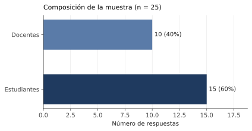
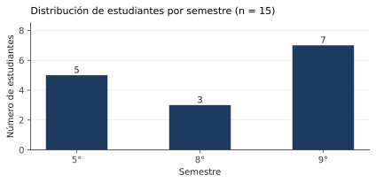
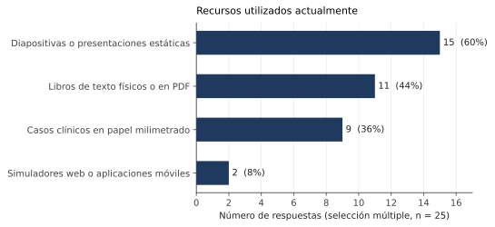
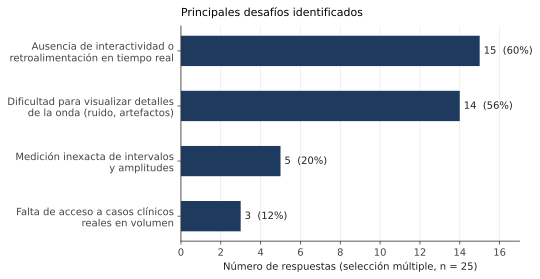
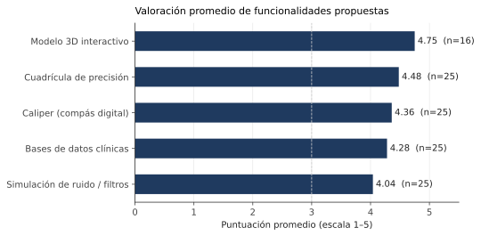
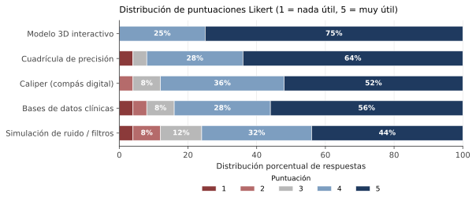
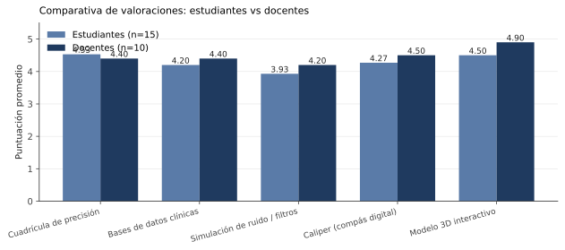

# Análisis de la Encuesta de Necesidades

**Herramientas digitales en el proceso de aprendizaje de señales EKG**
Universidad del Magdalena — Facultad de Ciencias de la Salud

---

## Tabla de contenido

1. [Resumen ejecutivo](#1-resumen-ejecutivo)
2. [Metodología](#2-metodología)
3. [Caracterización de la muestra](#3-caracterización-de-la-muestra)
4. [Recursos utilizados actualmente](#4-recursos-utilizados-actualmente)
5. [Desafíos identificados](#5-desafíos-identificados)
6. [Valoración de funcionalidades propuestas](#6-valoración-de-funcionalidades-propuestas)
7. [Análisis comparativo: estudiantes vs docentes](#7-análisis-comparativo-estudiantes-vs-docentes)
8. [Respuestas abiertas: función ideal](#8-respuestas-abiertas-función-ideal)
9. [Respuestas abiertas: comentarios finales](#9-respuestas-abiertas-comentarios-finales)
10. [Hallazgos clave y recomendaciones](#10-hallazgos-clave-y-recomendaciones)
11. [Limitaciones del estudio](#11-limitaciones-del-estudio)

---

## 1. Resumen ejecutivo

La encuesta recogió **25 respuestas** de la comunidad académica de la Universidad del Magdalena (15 estudiantes y 10 docentes), concentradas en el programa de Enfermería. Los resultados muestran un consenso claro sobre la necesidad de incorporar herramientas digitales interactivas al proceso de enseñanza-aprendizaje del electrocardiograma.

**Hallazgos centrales:**

| Hallazgo | Dato |
|---|---|
| Recurso predominante actualmente | Diapositivas estáticas (60 %) |
| Desafío principal | Falta de interactividad y retroalimentación (60 %) |
| Funcionalidad mejor valorada | Modelo 3D interactivo (media 4.75 / 5) |
| Funcionalidades con ≥ 84 % de aprobación (4–5) | Cuadrícula de precisión, caliper digital, modelo 3D, bases de datos clínicas |
| Demanda recurrente en respuestas abiertas | Retroalimentación inmediata, visualización anatómica y simulación clínica |

El estudio respalda el desarrollo de una plataforma que integre visualización precisa de la señal, medición digital, casos clínicos reales y representación anatómica tridimensional con retroalimentación en tiempo real.

---

## 2. Metodología

- **Instrumento:** formulario estructurado con preguntas de selección única, selección múltiple, escala Likert (1–5) y preguntas abiertas.
- **Población objetivo:** estudiantes y docentes de la Facultad de Ciencias de la Salud.
- **Tamaño muestral:** 25 respuestas válidas.
- **Fechas de recolección:** del 7 al 20 de mayo de 2026.
- **Análisis cuantitativo:** estadística descriptiva (frecuencias, medias, medianas, distribuciones).
- **Análisis cualitativo:** revisión temática de las respuestas abiertas para identificar patrones recurrentes.

> **Nota metodológica:** la pregunta sobre el modelo 3D fue añadida después de las primeras 9 respuestas, por lo que su muestra efectiva es n = 16. Esto se indica explícitamente en cada tabla que la incluye.

---

## 3. Caracterización de la muestra

### 3.1 Rol institucional

| Rol | Respuestas | Porcentaje |
|---|---:|---:|
| Estudiantes | 15 | 60 % |
| Docentes | 10 | 40 % |
| **Total** | **25** | **100 %** |

### 3.2 Programa académico

| Programa | Respuestas |
|---|---:|
| Enfermería | 24 |
| Medicina | 1 |

La muestra está conformada casi en su totalidad por miembros del programa de Enfermería. Este sesgo debe considerarse al interpretar los resultados.

### 3.3 Semestre (solo estudiantes)

| Semestre | Estudiantes |
|---:|---:|
| 5° | 5 |
| 8° | 3 |
| 9° | 7 |

Promedio: 7.5° semestre. Los estudiantes encuestados se encuentran en etapas intermedias y avanzadas de la carrera, lo que les otorga un marco de referencia formado sobre la enseñanza del EKG.

### 3.4 Asignaturas impartidas por los docentes

Los 10 docentes participantes cubren un espectro amplio del currículo:

- Enfermería Medicoquirúrgica I
- Procedimientos Básicos
- Médico Quirúrgica (cuidado crítico)
- Morfofisiología II
- Salud Pública
- Semiología
- Prácticas médico quirúrgica II
- Supervisión de práctica clínica maternoinfantil
- Teorías y Modelos en Enfermería
- Enfermería (sin especificar)

La diversidad de asignaturas sugiere que la enseñanza del EKG atraviesa varios niveles del programa, desde lo morfofisiológico hasta lo clínico aplicado.

---

## 4. Recursos utilizados actualmente

| Recurso | Respuestas | Porcentaje |
|---|---:|---:|
| Diapositivas o presentaciones estáticas | 15 | 60 % |
| Libros de texto físicos o en PDF | 11 | 44 % |
| Casos clínicos en papel milimetrado impreso | 9 | 36 % |
| Simuladores web o aplicaciones móviles | 2 | 8 % |

*Selección múltiple sobre n = 25.*

**Lectura:** los recursos actuales son predominantemente estáticos y unidireccionales. Solo el 8 % de los encuestados reporta usar simuladores o aplicaciones, lo que evidencia una brecha tecnológica concreta. Los tres recursos más utilizados (diapositivas, libros y papel impreso) comparten una limitación común: no permiten manipular la señal ni recibir retroalimentación.

---

## 5. Desafíos identificados

| Desafío | Respuestas | Porcentaje |
|---|---:|---:|
| Ausencia de interactividad o retroalimentación en tiempo real | 15 | 60 % |
| Dificultad para visualizar detalles de la onda (ruido, artefactos) | 14 | 56 % |
| Medición inexacta de intervalos y amplitudes | 5 | 20 % |
| Falta de acceso a casos clínicos reales en volumen | 3 | 12 % |

*Selección múltiple sobre n = 25.*

**Lectura:** dos desafíos concentran más del 55 % de las menciones cada uno. La ausencia de interactividad y la dificultad para visualizar detalles finos de la señal son problemas estructurales del modelo actual, no carencias periféricas. Cualquier propuesta de plataforma digital debe atacar estos dos frentes en su núcleo.

La medición inexacta y el acceso a casos reales aparecen con menor frecuencia, pero como se verá en la sección 6, las funcionalidades que los abordan reciben puntuaciones altas. Esto sugiere que los encuestados los reconocen como problemas reales aunque no los prioricen al elegir uno solo.

---

## 6. Valoración de funcionalidades propuestas

Se preguntó por la utilidad percibida (escala 1–5) de cinco funcionalidades específicas.

### 6.1 Puntuaciones promedio

| Funcionalidad | n | Media | Mediana | % puntuaciones 4–5 |
|---|---:|---:|---:|---:|
| Modelo 3D interactivo | 16 | **4.75** | 5.0 | **100 %** |
| Cuadrícula de precisión interactiva | 25 | **4.48** | 5.0 | **92 %** |
| Caliper (compás digital) | 25 | **4.36** | 5.0 | **88 %** |
| Bases de datos clínicas reales | 25 | **4.28** | 5.0 | **84 %** |
| Simulación de ruido y filtros | 25 | **4.04** | 4.0 | **76 %** |

### 6.2 Distribución de puntuaciones

| Funcionalidad | 1 | 2 | 3 | 4 | 5 |
|---|---:|---:|---:|---:|---:|
| Cuadrícula de precisión | 1 | 0 | 1 | 7 | 16 |
| Bases de datos clínicas | 1 | 1 | 2 | 7 | 14 |
| Simulación de ruido y filtros | 1 | 2 | 3 | 8 | 11 |
| Caliper (compás digital) | 0 | 1 | 2 | 9 | 13 |
| Modelo 3D interactivo | 0 | 0 | 0 | 4 | 12 |

**Lectura:**

- Las cinco funcionalidades superan el umbral de 4.0 en su media, lo que indica aceptación amplia.
- El **modelo 3D interactivo** alcanza la valoración más alta (4.75) y no recibió ninguna puntuación inferior a 4. Es la funcionalidad con respaldo más unánime.
- La **cuadrícula de precisión** y el **caliper digital** —dos herramientas que resuelven directamente la dificultad de visualización y medición— se encuentran entre las tres mejor valoradas.
- La **simulación de ruido y filtros**, aunque también bien valorada, es la que menos consenso genera (media 4.04, con 6 puntuaciones por debajo de 4). Es una funcionalidad técnicamente más especializada y probablemente menos intuitiva para quienes están en fases iniciales del aprendizaje.

---

## 7. Análisis comparativo: estudiantes vs docentes

| Funcionalidad | Estudiantes (media) | Docentes (media) | Diferencia |
|---|---:|---:|---:|
| Cuadrícula de precisión | 4.53 | 4.40 | +0.13 |
| Bases de datos clínicas | 4.20 | 4.40 | −0.20 |
| Simulación de ruido y filtros | 3.93 | 4.20 | −0.27 |
| Caliper (compás digital) | 4.27 | 4.50 | −0.23 |
| Modelo 3D interactivo | 4.50 | 4.90 | −0.40 |

**Lectura:**

- Ambos grupos coinciden en valorar positivamente todas las funcionalidades.
- Los **docentes muestran sistemáticamente puntuaciones más altas** en cuatro de las cinco funcionalidades, con la mayor diferencia en el modelo 3D (+0.40). Esto puede reflejar una percepción más clara, por su experiencia formativa, de las limitaciones del modelo actual.
- Los estudiantes valoran ligeramente más la cuadrícula de precisión, lo que sugiere que perciben con más urgencia la necesidad de medir y observar con detalle, problema que el docente ya ha aprendido a sortear.
- Las diferencias son pequeñas en magnitud (todas inferiores a 0.5 puntos) y los rangos se solapan, por lo que el consenso entre ambos grupos es mayor que sus discrepancias.

---

## 8. Respuestas abiertas: función ideal

Se preguntó: *"Si pudieras agregar una función ideal o mágica a una plataforma de estudio de señales EKG, ¿cuál sería?"*

De las 25 respuestas, **20 contienen propuestas sustantivas** (las 5 restantes fueron "n", "no", "nose" o equivalentes). Se identificaron seis categorías temáticas:

### 8.1 Categorías temáticas

| Categoría | Menciones | Descripción |
|---|---:|---|
| Retroalimentación / validación de diagnóstico | 6 | Simulación con respuesta inmediata, validar respuestas, retroalimentación clínica |
| Explicación fisiopatológica integrada | 5 | Explicar por qué ocurre cada hallazgo y qué parte del corazón está afectada |
| Visualización anatómica (3D / correlación) | 4 | Modelo 3D, correlación arteria–derivación–zona infartada |
| Resaltado e identificación visual de ondas | 4 | Colorear ondas afectadas, resaltar cada onda, cálculos en tiempo real |
| Simulación clínica dinámica | 3 | Pacientes en tiempo real, escenarios que cambian con las decisiones |
| Asistencia inteligente / IA | 2 | IA que analice el EKG y explique paso a paso |

### 8.2 Citas representativas (textuales)

> "Un corazón en el que al momento de agregar una patología (IAM, isquemia, etc.) muestre el cambio en tiempo real en el EKG […] no solo ver a qué sección del corazón corresponde la onda sino que muestre la afectación y el cambio morfológico."

> "Que después de identificar la alteración, explique fisiológicamente por qué ocurre y qué parte del sistema cardíaco está fallando."

> "Simulador de pacientes en tiempo real que cambie según las decisiones del estudiante. La plataforma explicaría automáticamente el significado de cada señal clínica y sus causas."

> "Paralelo entre el área isquémica o infartada, la arteria ocluida y la derivación que muestra la lesión o infarto." *(Docente, Semiología)*

> "IA interactiva que analice el EKG en tiempo real y explique paso a paso cada hallazgo, permitiendo identificar alteraciones como arritmias, bloqueos o isquemias de manera didáctica." *(Docente, Teorías y Modelos)*

> "Retroalimentación en la toma de decisiones según cada caso […] obtener una respuesta clínica en el simulador con base en esa decisión y obtener la retroalimentación inmediata." *(Docente, supervisión clínica)*

**Lectura:** las respuestas abiertas refuerzan los hallazgos cuantitativos. La demanda más recurrente no es por un visualizador estático mejorado, sino por una herramienta que **explique, retroalimente y simule**. La conexión entre la señal eléctrica, la anatomía y la fisiopatología aparece en al menos 9 de las 20 respuestas sustantivas.

---

## 9. Respuestas abiertas: comentarios finales

De las 25 respuestas, 13 fueron negativas o vacías ("no", "ninguno", ".", etc.) y 11 aportaron contenido relevante. Las categorías identificadas:

| Categoría | Menciones |
|---|---:|
| Necesidad de mayor practicidad e interactividad | 4 |
| Importancia formativa del tema | 3 |
| Pertinencia de la IA y las plataformas digitales | 2 |
| Metodologías recomendadas (ABP, bancos de EKG, talleres) | 2 |

### Citas representativas

> "La IA ya no será una opción, sino una habilidad básica de trabajo, por lo que la facultad debe asegurar que los egresados sean nativos digitales en su uso responsable." *(Docente, cuidado crítico)*

> "Utilizar herramientas más didácticas/visuales o incluso hacer algún ejercicio práctico. Particularmente en enfermería, se empieza a enseñar sobre el EKG desde morfofisiología II, pero sería bueno hacer uso de herramientas más interactivas para facilitar el aprendizaje, ya que en principio los conceptos pueden parecer algo abstractos." *(Estudiante)*

> "Es vital que los enfermeros y médicos generales sepan no solo tomar sino interpretar los resultados." *(Docente, Medicoquirúrgica I)*

> "Se recomienda el uso de plataformas digitales, bancos de EKG comentados y metodologías de aprendizaje basadas en problemas. También sería útil aumentar los espacios de acompañamiento docente y tutorías." *(Docente, Teorías y Modelos)*

> "Hacer talleres con experiencia fenomenológica. Es decir, que los mismos estudiantes puedan practicar con el instrumento y aprenderse mejor en qué parte va cada uno, que detecten anomalías y se empoderen en el uso y lectura del electrocardiograma." *(Estudiante)*

---

## 10. Hallazgos clave y recomendaciones

### 10.1 Hallazgos

1. **Brecha tecnológica concreta.** El 92 % de los recursos actuales son estáticos (diapositivas, libros, papel). Solo el 8 % usa simuladores. Existe espacio operativo para introducir una herramienta digital.
2. **Dos desafíos dominantes.** La falta de interactividad (60 %) y la dificultad de visualización fina (56 %) son los problemas centrales y deben ser el foco de cualquier solución.
3. **Aprobación amplia de las funcionalidades propuestas.** Las cinco superan media 4.0; cuatro de ellas tienen ≥ 84 % de respuestas en 4–5. El modelo 3D obtiene aprobación unánime entre quienes lo evaluaron.
4. **Consenso entre estudiantes y docentes.** Las diferencias entre grupos son pequeñas (< 0.5). La plataforma puede diseñarse para servir a ambos sin priorizar uno sobre el otro.
5. **Demanda explícita de explicación e integración.** Las respuestas abiertas insisten en que la herramienta no solo muestre, sino que **explique** la fisiopatología, **valide** el diagnóstico del usuario y **correlacione** la señal con la anatomía y la perfusión coronaria.

### 10.2 Recomendaciones priorizadas

**Prioridad alta — núcleo del producto:**

| Componente | Justificación |
|---|---|
| Visualización con cuadrícula de precisión y zoom | Resuelve el desafío de visualización (56 %) y obtiene 4.48 / 5 |
| Caliper digital (medición de intervalos y amplitudes) | Resuelve la medición inexacta y obtiene 4.36 / 5 |
| Modelo 3D del corazón vinculado al hallazgo electrocardiográfico | Mejor valorado (4.75 / 5, 100 % en 4–5) y aparece como demanda en respuestas abiertas |
| Retroalimentación inmediata sobre diagnósticos del usuario | Categoría temática más recurrente en preguntas abiertas (6 menciones) |

**Prioridad media — diferenciadores:**

| Componente | Justificación |
|---|---|
| Integración de bases de datos clínicas reales | 4.28 / 5; aborda la "falta de casos reales" (12 %) y aporta credibilidad clínica |
| Explicación fisiopatológica contextualizada por hallazgo | 5 menciones en preguntas abiertas; cierra el bucle pedagógico |
| Correlación arteria–derivación–territorio afectado | Solicitado específicamente por docentes de Semiología |

**Prioridad complementaria:**

| Componente | Justificación |
|---|---|
| Simulación de ruido y filtros digitales | Bien valorada (4.04) pero la menos consensuada; puede incorporarse como módulo avanzado |
| Asistencia mediante IA para análisis paso a paso | Demanda emergente, especialmente desde el cuerpo docente |
| Banco de casos clínicos progresivos con metodología ABP | Recomendación explícita en comentarios finales |

---

## 11. Limitaciones del estudio

- **Tamaño muestral reducido (n = 25).** Los resultados son indicativos y orientan el diseño, pero no pretenden generalización estadística.
- **Sesgo de programa.** 24 de 25 respuestas provienen de Enfermería. Las necesidades de otros programas (Medicina, Tecnología en Atención Prehospitalaria, etc.) podrían diferir.
- **Sesgo de autoselección.** Quienes respondieron probablemente tienen mayor interés en el tema, lo que puede sobrerrepresentar las valoraciones positivas hacia funcionalidades digitales.
- **Pregunta del modelo 3D incorporada tardíamente.** Su evaluación se basa en n = 16 (los 9 primeros estudiantes no respondieron). Las conclusiones sobre esta funcionalidad deben matizarse en consecuencia.
- **No se midieron variables como uso previo de tecnología, nivel de competencia digital o experiencia clínica.** Estas podrían explicar parte de la varianza en las respuestas.

---

*Documento elaborado para el proyecto de Yuluka.*
